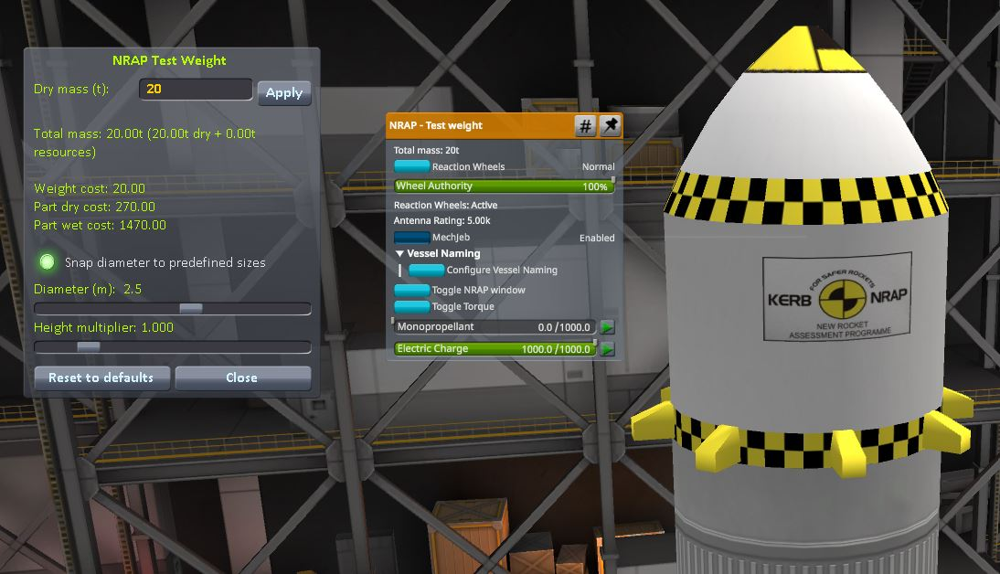
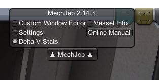
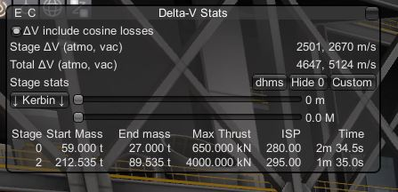

# KSP Rocket Design Challenge

This script `rocket.py` simulates and scores rockets based on four characteristics, measured at
exit of kerbin sphere of influence.

* total mass to SOI exit 
* usable deltaV at SOI exit
* cost per kilo
* cost per unit delta V

You can plug in weights for the scores to get a final score

## Test Mass 

We use the NRAP mod which provides a "test mass" that also robotically controls the craft
and can be configured to have any diameter and weight that you want.



1. Start a new vehicle
1. Click on the "Utility" tab (bottom-most button on the vehicle parts menu on the left)
1. Select the "NRAP - Test Weight" and click to drop it into the VAB
1. Right click on the test weight and you'll get an orange-topped menu
1. Click "Toggle NRAP window" to view the configuration menu (left-most in picture)
1. Choose your mass, and diameter. Then click "Apply", then "Close"

## Flying and scoring a rocket

You can fly your rocket and calculate the scores using `rocket.py`. Here's the bits you need to edit:

```python
# ---------- rocket parameters --------------

# read these out from KSP
soi_exit_delta_v = None  # set this to "None" if you want to simulate
payload_mass_tons = 0.5
rocket_cost = 50000

<snip>

# ----------- scoring weights ... how important is each parameter?
weights = Weights(
    absolute_payload=0.25,
    absolute_dv=0.25,
    cost_per_kilo=0.25,
    cost_per_unit_dv=0.25)
```

Just fill out `soi_exit_delta_v`, `payload_mass_tons`, and `rocket_cost`. Then set the weights
to get your score:

```buildoutcfg
======== SCORING =========

Total payload mass :  20.0 tons    / 50t   = 0.40 pts
Available DV       :   784 m/s     / 10K   = 0.08 pts
Cost / kg          :  3.60 $       / 20    = 0.82 pts
Cost / unit DV     : 91.84 $       / 50    = 0.00 pts

WEIGHTINGS
   payload_mass       25%
   absolute_dv        25%
   cost_per_kilo      25%
   cost_per_unit_dv   25%

FINAL SCORE = 0.32
```

## Simulating a rocket flight

If you want to iterate faster without test flying every time, set your `soi_exit_delta_v` to 0 and then fill out
per stage information to use in the simulation. First design your rocket in KSP and click the "Delta-V Stats"
button from the MechJeb menu



You can now use the MechJeb Delta-V Stats pane that looks like this to find your vital stage information:



If you can't see all the columns you need, toggle the rightmost button "Short stats/Long stats/Full stats/custom". You'll need to read these figures and plug in them into the `rocket.py`  script as follows:

```python
if soi_exit_delta_v is None:
    # ----------- simulation parameters

    # Read these stage stats out of mechjeb, but be sure to pick the vacuum ISP for the final
    # stage as this will determine the final delta V estimate. You don't need these if
    # you are just calculating the scores from your run
    #         start mass             end mass            max thrust       ISP      time
    stages = [
        Stage(start_mass_tons=3, end_mass_tons=2, thrust_kns=20, isp=320, burn_time=100),
        Stage(start_mass_tons=20, end_mass_tons=5, thrust_kns=670, isp=280, burn_time=20),
        Stage(start_mass_tons=80, end_mass_tons=25, thrust_kns=2500, isp=195, burn_time=40)
    ]
    soi_exit_delta_v = simulate(stages)
```

The simulation assumes you'll fly directly upwards, full throttle, and staging as fast as possible until you achieve a velocity that puts your apoapsis above 86,000km, which is
outside the Kerbin sphere of influence (SOI). On your final stage it checks whether or not
you can coast to SOI exit, before terminating the burn early if you can.

Run the script as follows:

```
PS G:\Users\mkb23\Code\rocket> python .\rocket.py
Gravity at sea level = 9.80 m/s^2
------- STAGE 0 --------      
TIME      ALT     VEL      TWR
0.0s       0    0.90    1.92  
10.0s     475   97.22    2.05 
20.0s    1979  206.89    2.20 
30.0s    4653  332.15    2.39 
40.0s    8669  475.70    2.61 
50.0s   14224  640.87    2.89 
60.0s   21554  831.83    3.25 
70.0s   30943  1053.88    3.70
80.0s   42734  1313.99    4.30
90.0s   57353  1621.61    5.10
94.9s   65705  1793.51    5.60
------- STAGE 1 --------      
TIME      ALT     VEL      TWR
0.0s   65884  1793.82    1.38 
10.0s   83987  1828.50    1.51
20.0s  102478  1871.38    1.66
30.0s  121438  1922.58    1.82
40.0s  140952  1982.25    1.99
50.0s  161105  2050.62    2.19
60.0s  181987  2128.00    2.42
70.0s  203688  2214.76    2.68
80.0s  226306  2311.39    2.97
90.0s  249941  2418.43    3.30
100.0s  274700  2536.60    3.69
110.0s  300700  2666.70    4.13
Reached velocity to coast to SOI exit with burn time 117.0s
Remaining mass = 34668kg ; Dry mass = 27000kg        
Remaining Delta V at SOI exit = 784 m/s

(it will then print out your final score)
```

## Planning versus Qualifying

Once you've designed your rocket and estimated its score, you need to fly a qualification mission and actually measure the remaining delta V at SOI exit.

When you are planning your mission set `qualification_soi_exit_delta_v` to `None` and it
will run a simulation to estimate this. The simulation is usually a bit optimistic because it doesn't consider e.g. drag.


```python
# ---------- rocket parameters --------------

soi_exit_delta_v = None  # set this to "None" if you want to simulate  
```

When you are ready measure your actual delta V and plug it in, and it will skip the simulation
and use that number to calculate the score instead.

